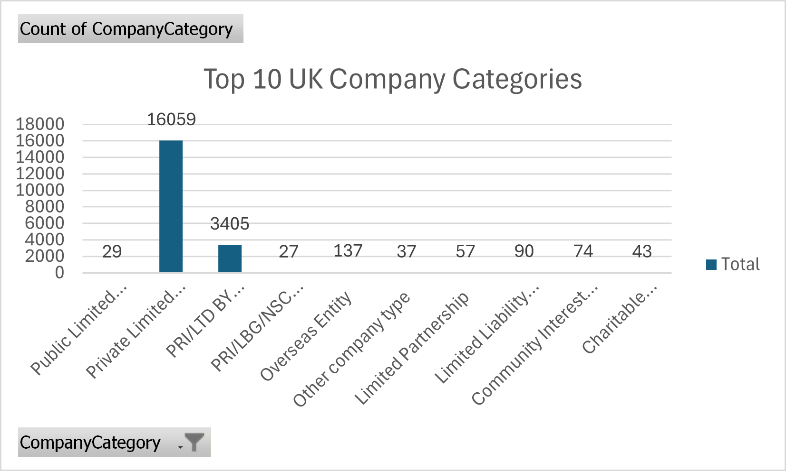
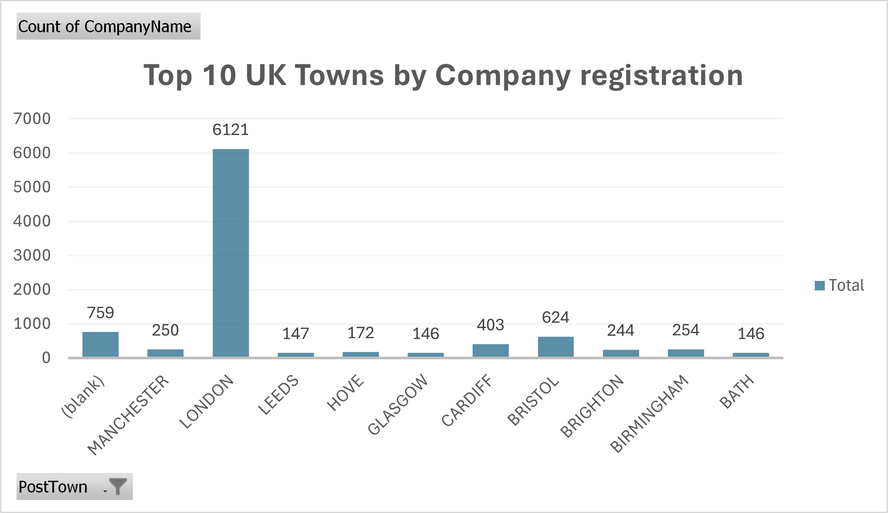
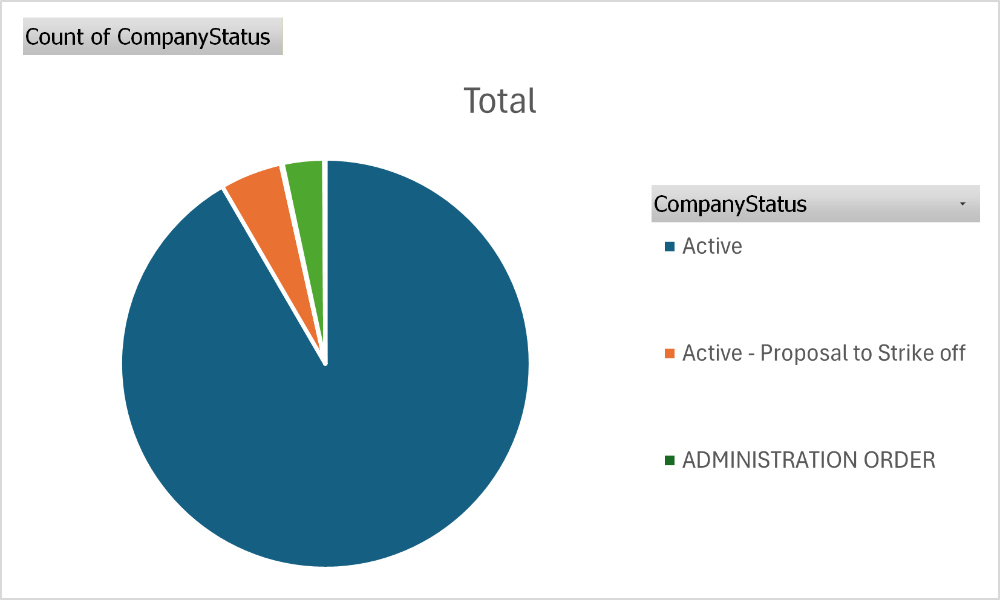
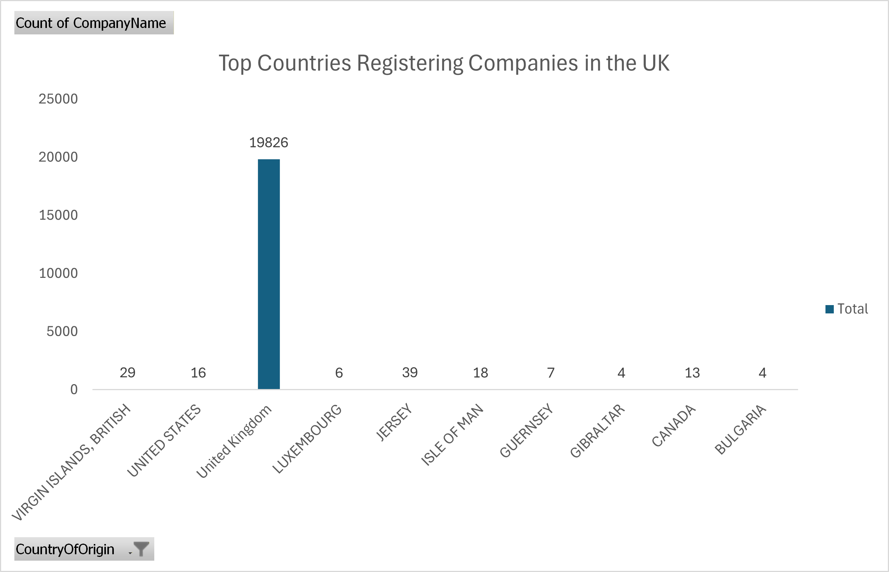

# UK Business Formation SQL Analysis

## Project Overview
This project explores UK Companies House data to analyse patterns in company formation, business structures, and regional economic activity using SQL and Excel visualisations.

## Dataset
Source: UK Companies House open data.

The dataset contains information about:
- Company name
- Company number
- Address and location
- Company category
- Company status
- Country of origin

## Key Analysis Areas
- Company structure distribution
- Business activity by town and county
- Domestic vs foreign company registrations
- Company status and business risk patterns
- Geographic clustering of businesses

## Visualisations

### Company Categories

### Business Activity by Town

### Company Status Distribution

### Company Origin

## Tools Used
- SQL
- Excel
- GitHub

## Key Insights
- Private Limited Companies dominate the UK business ecosystem.
- Business activity is heavily concentrated in major cities like London.
- Most registered companies originate from the United Kingdom, with a smaller share of international registrations.
