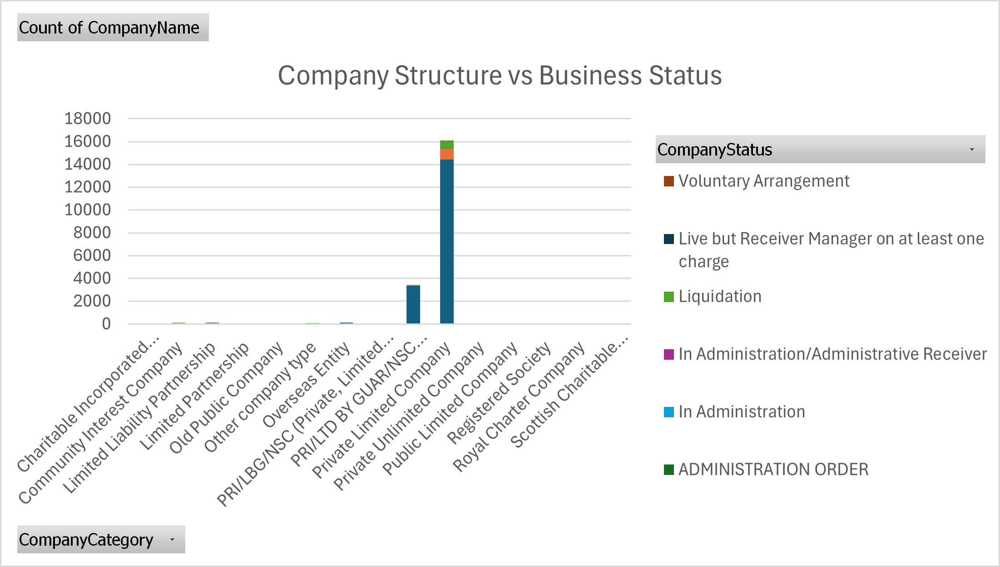
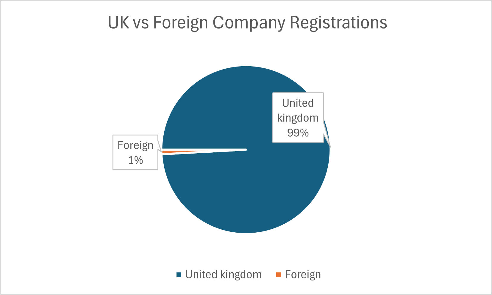
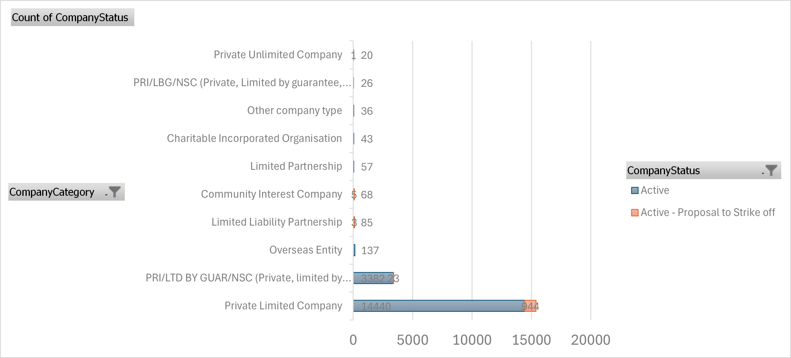
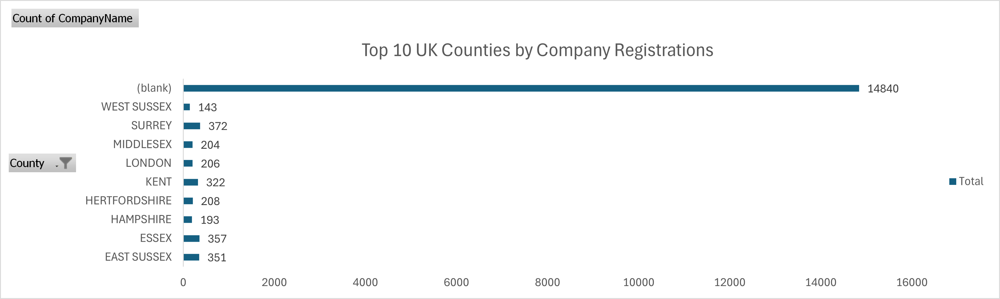
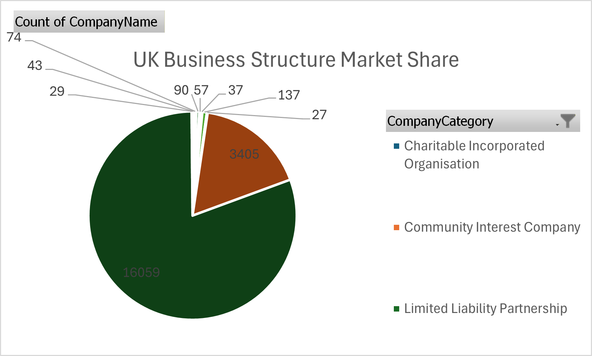
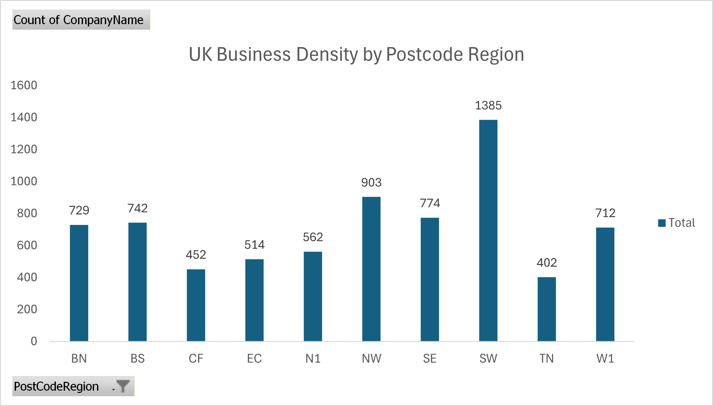

# UK Business Formation SQL Analysis

## Project Overview

This project analyses UK Companies House data to explore patterns in company formation, business structures, and geographic business activity.  
Using SQL-style analytical thinking and Excel visualisation techniques, the project investigates how businesses are distributed across the United Kingdom by structure, status, location, and origin.

The objective of this project is to demonstrate practical data analysis skills by transforming raw company registration data into meaningful business insights through structured queries and visualisations.

---

## Dataset

The dataset is derived from publicly available UK Companies House data and contains information about registered companies, including:

- Company Name
- Company Number
- Address information
- Post Town
- County
- Postcode
- Company Category
- Company Status
- Country of Origin

A sample dataset used for this analysis is included in the *data* folder.

---

## Tools Used

This project was completed using:

- *SQL-style data analysis*
- *Microsoft Excel*
- *PivotTables and PivotCharts*
- *Data visualisation techniques*
- *GitHub for project documentation and version control*

---

## Key Analysis Areas

The analysis focuses on several important aspects of the UK business landscape:

- Distribution of company structures
- Geographic clustering of businesses
- Business activity by town and county
- Domestic vs international company registrations
- Business risk patterns through company status analysis
- Market share of different company categories

---

# Visualisations

## 1. Company Category Distribution

This chart shows the most common company structures registered in the UK, highlighting the dominance of Private Limited Companies compared to other legal structures.

---

## 2. Top UK Towns by Company Registrations

This visualisation highlights the towns with the highest number of registered companies, illustrating how business activity is concentrated in major urban centres.

---

## 3. Company Origin Distribution

This chart compares companies originating from the United Kingdom with those registered from foreign jurisdictions.

---

## 4. Company Status Distribution

This analysis shows the distribution of companies by operational status, including active companies, companies under administration, and those proposed for strike-off.

---

## 5. Company Structure vs Business Status

This visualisation explores how company status varies across different company structures, providing insight into potential patterns of business risk.

---

## 6. UK vs Foreign Company Registrations

This chart illustrates the proportion of companies registered domestically compared to those originating from outside the UK.

---

## 7. Company Status by Structure

This analysis examines how business status is distributed across different company structures, helping to understand operational patterns within the UK business ecosystem.

---

## 8. Top Counties by Company Registrations

This chart highlights the counties with the highest levels of company registrations, revealing regional concentrations of economic activity.

---

## 9. UK Business Structure Market Share

This visualisation shows the proportion of each company category within the overall UK business ecosystem.

---

## 10. Business Density by Postcode Region

This analysis reveals business activity clusters by postcode region, providing a geographic perspective on company distribution.

---

# Key Insights

Several insights emerge from this analysis:

- *Private Limited Companies dominate the UK business ecosystem*, representing the majority of company registrations.
- *Business activity is highly concentrated in major cities*, particularly London.
- *Most registered companies originate within the United Kingdom*, though international registrations are present.
- *Regional clusters of business activity appear in specific counties and postcode regions*, indicating economic hubs.
- *Company status patterns vary across legal structures*, suggesting differences in operational stability and business lifecycle.

---

# Repository Structure
